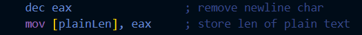
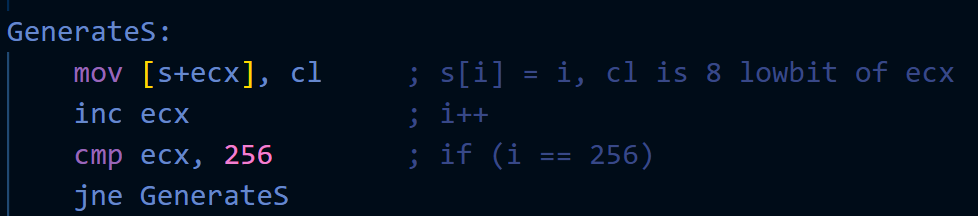
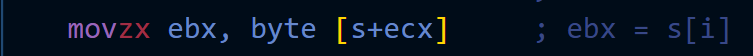
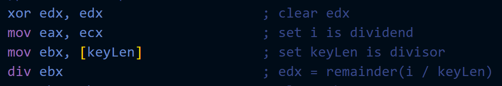
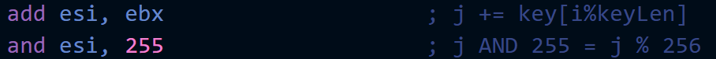
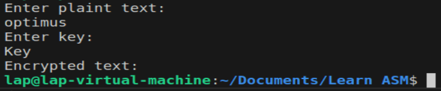
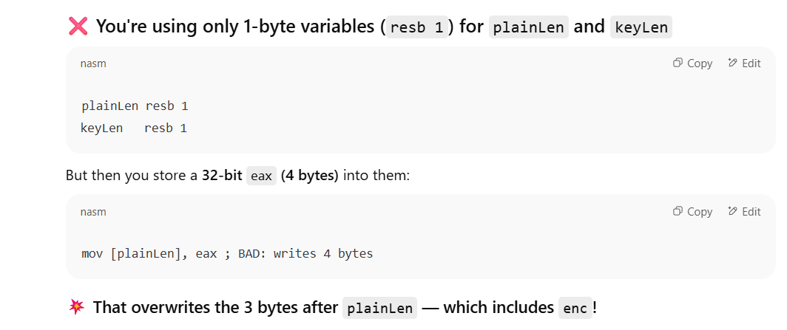
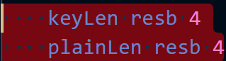

# **Report after `rc4.asm` (TASK 1)**
### _Author: Bui Quoc Lap (l4pp)_

#### *Note: this is not followed by time (past -> present)*

## Problem 1: Len of input

### Descripition:
The input (plaintext, key) contain also EnterCharacter. Therefore, the real length of input I need is `eax - 1` while `eax` store len of input after taking input process.

### Solution:
Minus 1 from `eax` before store len. Below is example for `plaintext`

## Problem 2: Not match size

### Description:
Get confused when want to generate S (set `s[i] = i`). For first time, I want to set a counter register for `s[]` and then store it's value right at `s[i]`. But a register value is 4 bytes while each `s[i]` is only 1 byte.  
→ Do not match size to do `mov s[ecx], ecx`.

### Solution:
Only take 8 low bit of `eax` to store in `s[i]`. Because `s[]` array only have 256 elements, then only 8 low bit of `eax` is enough and match size with `s[i]`.

## Problem3: Not match size ver 2

### Description:
One more times `Do not match size for mov`. But now is reverse, I need to store `s[i]` into register `ebx`(or others in other case) but `s[i]` is 1 byte but `ebx` is 4 bytes. If use `mov` as normal, only 1 byte of `ebx` changed and make unexpected behaviors.

### Solution:
Use `movzx` instead of `mov`. `movzx` means "mov zero extended", it will add `0` to make 1 byte `s[i]` to match with a 4 bytes register. For example, if `s[i] = 10000001`, `movzx` will make it to `00000000000000000000000010000001` and assign for `ebx` to make sure `ebx` now will only contain value of `s[i]`.

> Addition: `byte [s+ecx]` mean value at offset `[s+ecx]`, which mean `s[i]`.  
> Addition2: After leant about the different between `movzx` and `mov`. I changed some points in program which may appear same different size issues.

## Problem 4: Math issues
#### _Note: Not kind of problem, just other way to perform 1 action but easier_

### Descripition:
When I want perform `mod` operation in asm, the traditional way take 4 lines and use many resgisters

### Solution:
A math trick I learn on internet and I still can not prove why it true:). It states ` a % b = a AND (b-1) ONLY IF b = power of 2 (like 1,2,4,8,16,...)`. And luckily, most of `b` in my case is 256 (2^8) and I can use this! Only the case of `keylen` before is not.

### Problem 5: Memory Corruputed

### Descripition:
At first, when store `plainLen`, I use whole `eax` which is 4 bytes but only declare `plainLen` as 1 byte. Therefore, other memory has been overwritten and output (at that time only unchanged input) has been corrupted

### Solution:
After that, I changed size of variable store len into 4 bytes.

> _Addition: I think another bug also make memory corrupt which is I only declare and use 255 instead of 256 bytes for S-box._

## Problem 6: Misunderstanding RC4 Algorithm

### Description:

- I only thought that RC4 only perform `cipher[i] = cipher[i] ^ s[i]`.
- when I see ` j = (j + s[i]+ key[i%keyLen])`, I thought it was:
    - ` j += j`, this part is wrong.
    - and `j += s[i]` 
    - and ` j += key[i%keyLen]`

- At PRGA state, I thought the formula of encryption was `cipher[i] = plaintext[i] ^ keyStream[i]`, but no, for each step:
    - index of cipher and plaintext is `k` (I used 1 more register to store and increase this value).
    - index of keyStream is `t (= s[i] + s[j]) % 256`
    - `i,j` is just index used for jump in `array s[]`.
    - --> True formula encryption is ` cipher[k] = plaintext[k] ^ keyStream[t]`

### Solution:
With powerful supporter chat**T, I had solved each misunderstand step by step :33 Thanks for chatGPT.
