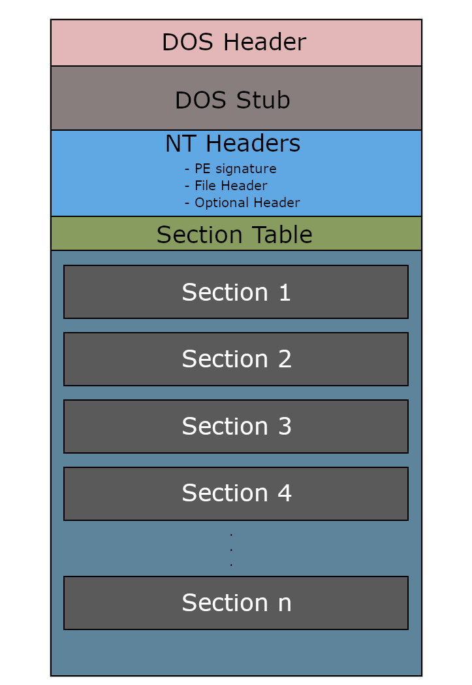
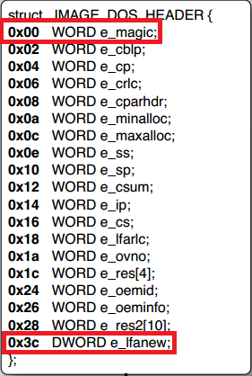
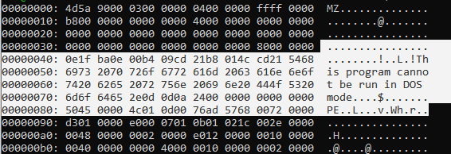
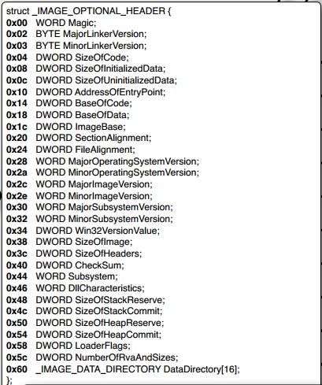

# Portable Executable File Format (PE File Format)

## What is PE file ?
- PE (Portable Executable) is a file format of files can be executed on Window OS.
- Common filename extension of PE file: `.exe`, `.dll`, `.sys`, `.obj`,...

## PE file structure



### I. DOS MZ Header
- This is the start of every PE file.
- Size: 64 bytes (`0x00 -> 0x40`)
- This part make PE file can be executed in DOS, so it will be run only when you run PE file on a DOS and do thing in `DOS stub`. 



There are 2 most important part here:
- `e_magic`: magic number
    - value in [`0x00 -> 0x02`] 
    - normaly value is `0x5A 0x4D` aka "MZ" in ACSII.
    - signature mark this file is executable on MS-DOS.

- `e_lafnew`: offset of PE header
    - store in [`0x3c -> 0x40`] 


### II. DOS Stub
- Little program run when PE file is executed in DOS.
- For normal PE file, it just print an error `This program cannot be run on DOS mode`.
- Programmer can easy edit this message by some hex dump editor like `xxd, HxD,...`.
- We don't have to worry about this part when our program expected to run on modern Windows OS.



>Here is DOS Stub of a random file `.exe` I got when compile C++ program into exe file.

### III. NT Header
In general, it contains **3 part**: PE signature, file header, optional header but the name will be a little different between 32-bit and 64-bit machine's architecture.
#### a) PE Signature
- To verify a PE file.
- Often has value `0x50 0x45 0x00 0x00` meaning `PE` in ASCII, 2 padding bytes because it's a `DWORD` data type.

#### b) File header

- Some documents call it "The COFF File header".
- Hold information about PE file as its name.

```
typedef struct _IMAGE_FILE_HEADER {
    WORD    Machine; // name of CPU architecture
    WORD    NumberOfSections; // size of section table
    DWORD   TimeDateStamp; // time when file was created
    DWORD   PointerToSymbolTable; // { 2 parts get zero if there 
    DWORD   NumberOfSymbols;      //   is no symbol table }
    WORD    SizeOfOptionalHeader; // size of optional header part
    WORD    Characteristics; // flag describe attributes of file (a dll/app/sys_file/....)
} IMAGE_FILE_HEADER, *PIMAGE_FILE_HEADER;
```


#### c) Optional header
- Very important even called "Optional".
- "Optional" because some PE file type does not have but image files have.
- There is some different between 32-bit and 64-bit executable:
    - The number of member defined within the structure.
    - Data type of some of the member.
- Main content still the same, therefore I will use 64-bit version for explaination



- `Magic`: determines version of file is 32-bit (`0x01 0x0b`)or 64-bit (`0x02 0x0b`).We still need this part because the field `machine` in `IMAGE_FILE_HEADER` is ignored by Window PE loader.
- `Linker version (major and minor)`:  version of linker of file.
- Size of element:
    - `SizeOfCode`: size of `.text` section. 
    - `SizeOfIntitializedData`: size of `.data` section.
    - `SizeOfUninitializedData`: size of `.bss` section.
    > If there are multiple sections in which elements, then size will be sum of all sections.
- `AddressOfEntryPoint`: an RVA of entry point when the file is loaded into memory (RVA = Relatives Virtual Address = offset calculated from first address of file).
    - For image program: point to starting address (main function).
    - For device drivers: point to initialization function.
    - For DLLs: optional, set to 0 if there is no entry point.

- `BaseOfCode`: RVA of the start of code section.
- `BaseOfData(PE32 only)`: RVA of the start of data section.
- `ImageBase`: 
    - Preferred address of first byte of image when loaded into memory.
    - Almost never used because Window's memory protections will change location image.
    - This problem will be fixed with relocate process.
- `SectionAlignment`: 
    - The alignment (in bytes) of sections when they are loaded into memory.
    - Must be >= `FileAlignment`
    - The default is the page size.
    - Address of each section will be multiples of this value.
- `FileAlignment`: 
    - The alignment (in bytes) of raw data of sections.
    - The value should be power of 2 between 512 and 64K.
    - If the `SectionAlignment` is less than page size, then `FileAlignment` must match `SectionAlignment`.
- `MajorOperatingSystemVersion, MinorOperatingSystemVersion, MajorImageVersion, MinorImageVersion, MajorSubsystemVersion and MinorSubsystemVersion` : content as their name :>
- `Win32VersionValue`:  should be set to 0.
- `SizeOfImage`: size of image file (in bytes), including all section and header in `SectionAlignment`.
- `SizeOfHeader`: size of `DOS stub + NT header + section header`.
- `CheckSum`: checksum of image file, used to validate the image at load time.
- `Subsystem`: specifiy Windows subsystem (if any) that is required to run the image.
- `DLLCharacteristics`: some characteristics of image file.
- `SizeOfStackReserve, SizeOfStackCommit, SizeOfHeapReserve and SizeOfHeapCommit`: content as their name :>
- `LoaderFlag`: should be set to 0.
- `NumberofRvaAndSizes`: size of `DataDirectory` array.
- `DataDirectory`: an array of `IMAGE_DATA_DIRECTORY` structures contains up to 16 entries:<br>
    - An `IMAGE_DATA_DIRECTORY` structure is defined as follows:
        ```
        typedef struct _IMAGE_DATA_DIRECTORY {
        DWORD   VirtualAddress; // RVA of Data directory
        DWORD   Size;           // Size of Data directory
        } IMAGE_DATA_DIRECTORY, *PIMAGE_DATA_DIRECTORY;
        ```

    - Each data directory contain different useful information needed for loader base on their name
    - If which data directory value set to 0, that mean these data directory is not used in PE file.
        ```
        // Directory Entries

        #define IMAGE_DIRECTORY_ENTRY_EXPORT          0   // Export Directory
        #define IMAGE_DIRECTORY_ENTRY_IMPORT          1   // Import Directory
        #define IMAGE_DIRECTORY_ENTRY_RESOURCE        2   // Resource Directory
        #define IMAGE_DIRECTORY_ENTRY_EXCEPTION       3   // Exception Directory
        #define IMAGE_DIRECTORY_ENTRY_SECURITY        4   // Security Directory
        #define IMAGE_DIRECTORY_ENTRY_BASERELOC       5   // Base Relocation Table
        #define IMAGE_DIRECTORY_ENTRY_DEBUG           6   // Debug Directory
        //      IMAGE_DIRECTORY_ENTRY_COPYRIGHT       7   // (X86 usage)
        #define IMAGE_DIRECTORY_ENTRY_ARCHITECTURE    7   // Architecture Specific Data
        #define IMAGE_DIRECTORY_ENTRY_GLOBALPTR       8   // RVA of GP
        #define IMAGE_DIRECTORY_ENTRY_TLS             9   // TLS Directory
        #define IMAGE_DIRECTORY_ENTRY_LOAD_CONFIG    10   // Load Configuration Directory
        #define IMAGE_DIRECTORY_ENTRY_BOUND_IMPORT   11   // Bound Import Directory in headers
        #define IMAGE_DIRECTORY_ENTRY_IAT            12   // Import Address Table
        #define IMAGE_DIRECTORY_ENTRY_DELAY_IMPORT   13   // Delay Load Import Descriptors
        #define IMAGE_DIRECTORY_ENTRY_COM_DESCRIPTOR 14   // COM Runtime descriptor
        ```
    